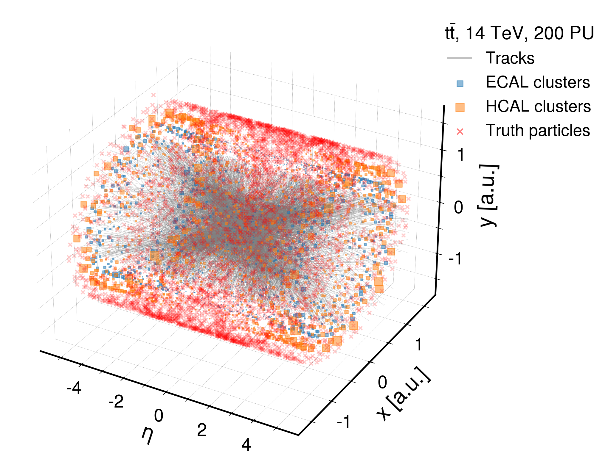
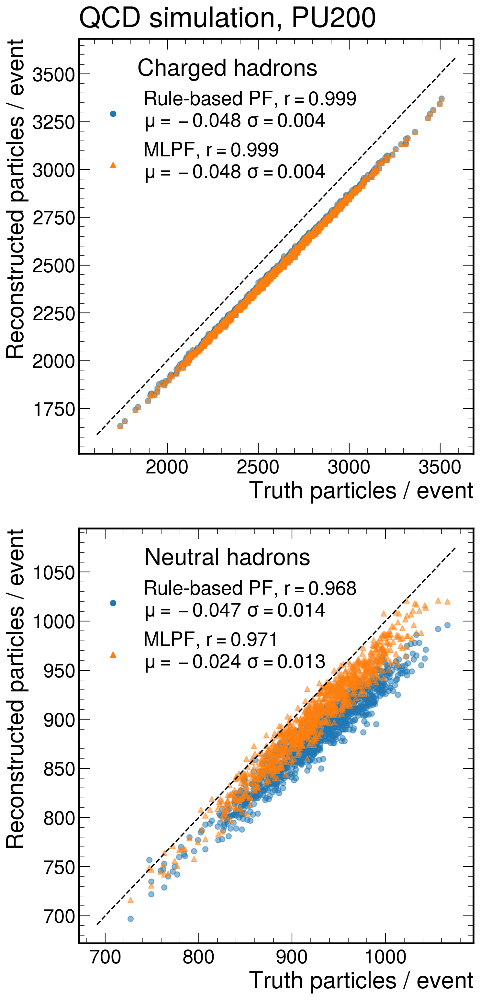
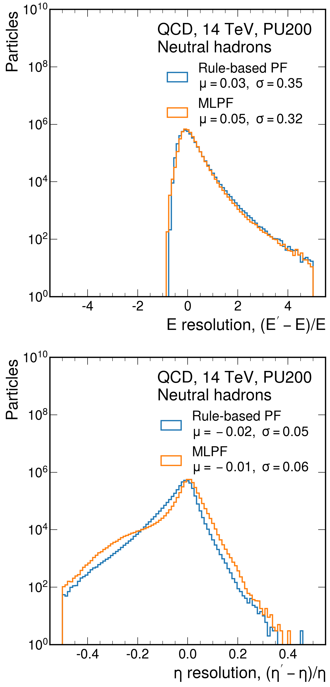

  

  
  

## MLPF with Delphes

Short instructions with a single test file in [notebooks/delphes-tf-mlpf-quickstart.ipynb](notebooks/delphes-tf-mlpf-quickstart.ipynb).

Long instructions for reproducing the full training from scratch in [README_delphes.md](README_delphes.md).
The plots can be generated using the notebook [delphes/resolution_checks.ipynb](delphes/resolution_checks.ipynb).

### Delphes dataset
The dataset is available from zenodo: https://doi.org/10.5281/zenodo.4452283.

### Software setup
The software setup for the ML training is available in the singularity spec file [scripts/base.singularity](scripts/base.singularity).

## Acknowledgements
This project is supported by the Mobilitas Pluss Returning Researcher Grant MOBTP187 of the Estonian Research Council. Part of this work was conducted at **iBanks**, the AI GPU cluster at Caltech. We acknowledge NVIDIA, SuperMicro and the Kavli Foundation for their support of **iBanks**. 
