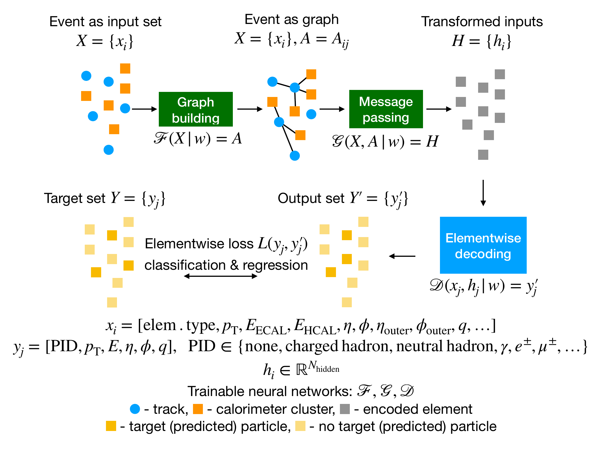
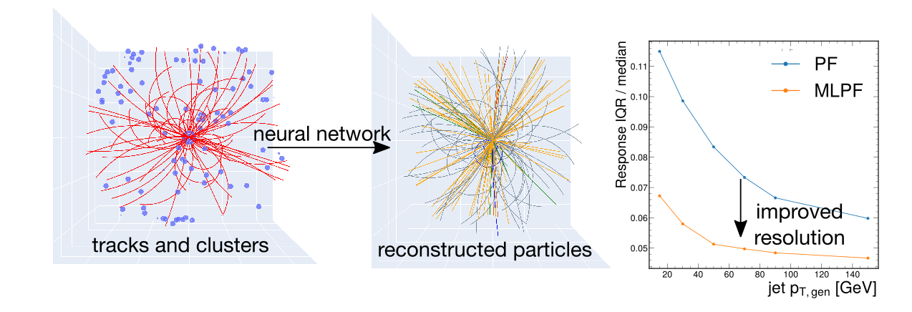
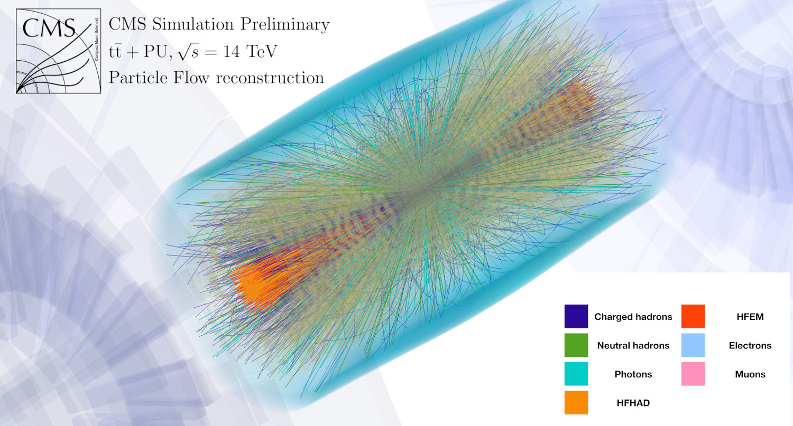
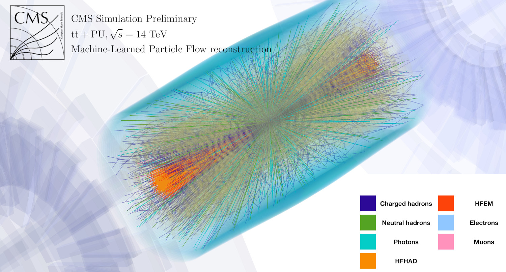
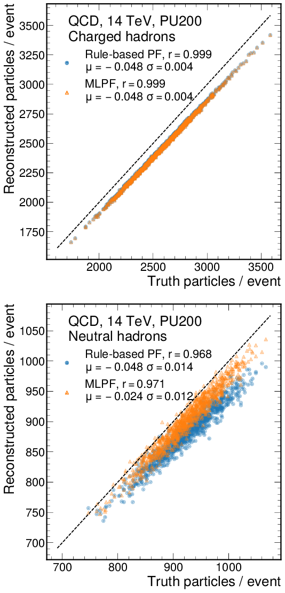
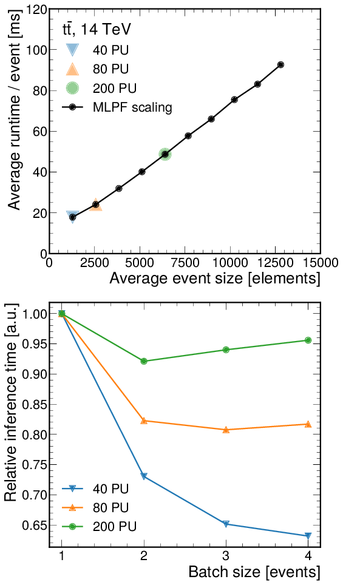

# Overview
MLPF focuses on developing full event reconstruction based on computationally scalable and flexible end-to-end ML models.

  

## MLPF on open datasets

  

  - paper: https://doi.org/10.1038/s42005-024-01599-5
  - code: https://doi.org/10.5281/zenodo.10893930
  - dataset: https://doi.org/10.5281/zenodo.8409592
  - results: https://doi.org/10.5281/zenodo.10567397
  - weights: https://huggingface.co/jpata/particleflow/tree/main/clic/clusters/v1.6

## MLPF development in CMS

  
  

  

  - ACAT 2022:
    - CERN-CMS-DP-2022-061, http://cds.cern.ch/record/2842375
  - ACAT 2021:
    - J. Phys. Conf. Ser. 2438 012100, http://dx.doi.org/10.1088/1742-6596/2438/1/012100
    - CERN-CMS-DP-2021-030, https://cds.cern.ch/record/2792320

## Initial development with Delphes

  
  

  - paper: https://doi.org/10.1140/epjc/s10052-021-09158-w
  - code: https://doi.org/10.5281/zenodo.4559587
  - dataset: https://doi.org/10.5281/zenodo.4559324
