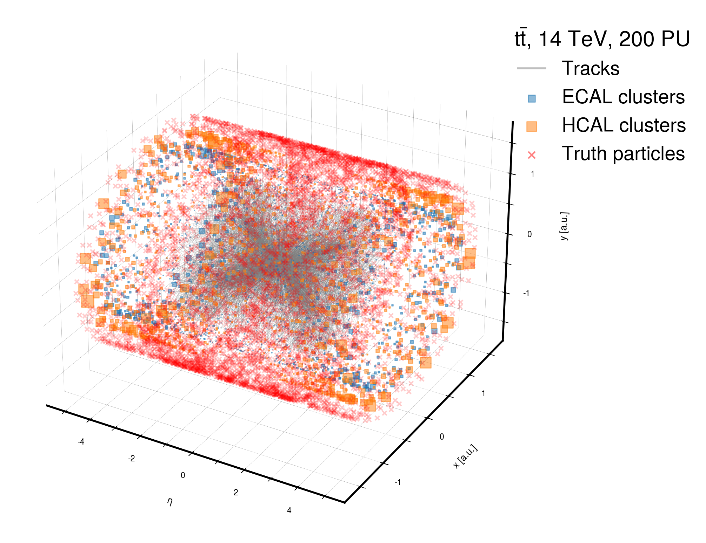
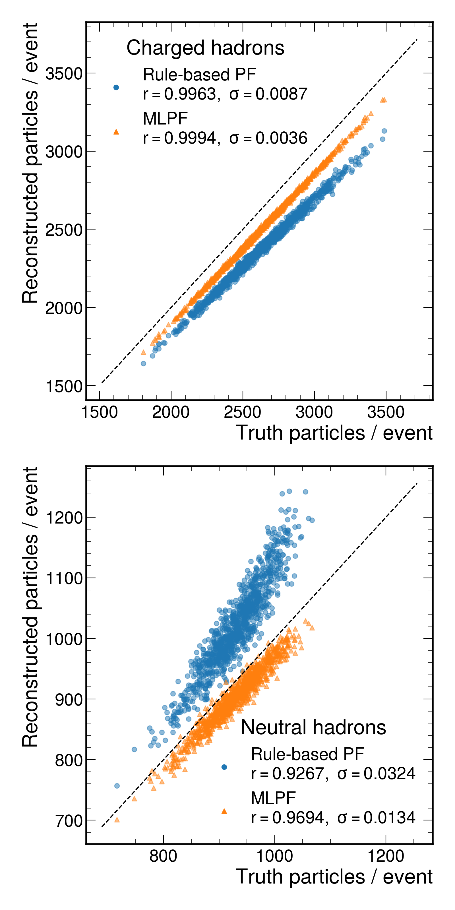
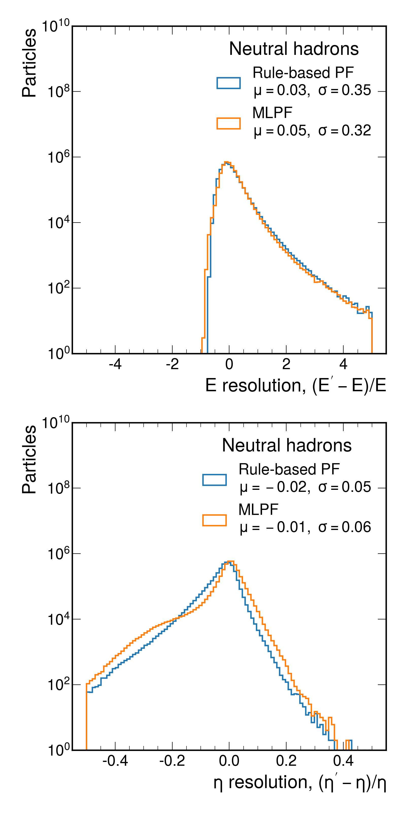

<p float="left">
  
</p>

<p float="left">
  
  
</p>

## MLPF with Delphes

Short instructions with a partial dataset
```bash
scripts/local_test.sh
```

Long instructions for reproducing from scratch
```bash
cd delphes

# Run the simulation step
# Generate events with pythia, mix them with PU and run a detector simulation using Delphes
singularity exec http://jpata.web.cern.ch/jpata/centos7hepsim.sif ./run_sim.sh

# Run the ntuplization step
# generate X,y input matrices for NN training in out/pythia8_ttbar/*.pkl
singularity exec http://jpata.web.cern.ch/jpata/centos7hepsim.sif ./run_ntuple.sh

# Generate the TFRecord datasets needed for larger-than-RAM training
singularity exec --nv http://jpata.web.cern.ch/jpata/base.simg python3 ../mlpf/tensorflow/delphes_data.py --datapath out/pythia8_ttbar

# Run the training of the base GNN model
singularity exec --nv http://jpata.web.cern.ch/jpata/base.simg python3 ../mlpf/tensorflow/delphes_model.py --model-spec parameters/delphes-gnn-skipconn.yaml --action train

#Run the validation to produce the predictions file
singularity exec --nv http://jpata.web.cern.ch/jpata/base.simg python3 ../mlpf/tensorflow/delphes_model.py --model-spec parameters/delphes-gnn-skipconn.yaml --action validate --weights ./experiments/delphes-gnn-skipconn-*/weights.100-*.hdf5
```

The plots can be generated using the notebook [delphes/resolution_checks.ipynb](delphes/resolution_checks.ipynb).

### Delphes dataset

### Recipe to prepare Delphes singularity image

```bash
wget http://atlaswww.hep.anl.gov/hepsim/soft/centos7hepsim.img
sudo singularity build --sandbox centos7hepsim.sandbox centos7hepsim.img
sudo singularity exec -B /home --writable centos7hepsim.sandbox ./install.sh
sudo singularity build centos7hepsim.sif centos7hepsim.sandbox
sudo rm -Rf centos7hepsim.sandbox
```

## Acknowledgements

This project is supported by the Mobilitas Pluss Returning Researcher Grant MOBTP187 of the Estonian Research Council. Part of this work was conducted at **iBanks**, the AI GPU cluster at Caltech. We acknowledge NVIDIA, SuperMicro and the Kavli Foundation for their support of **iBanks**. 
