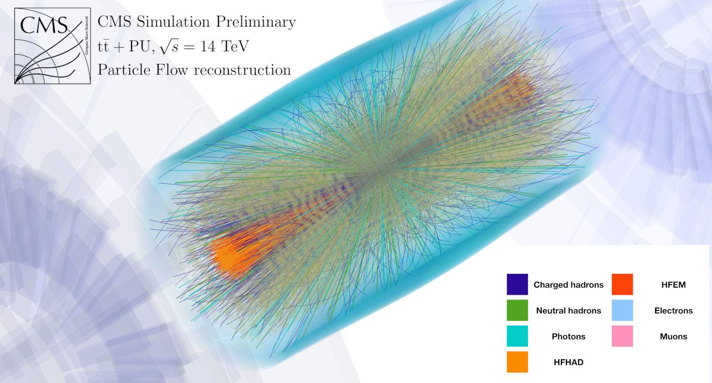
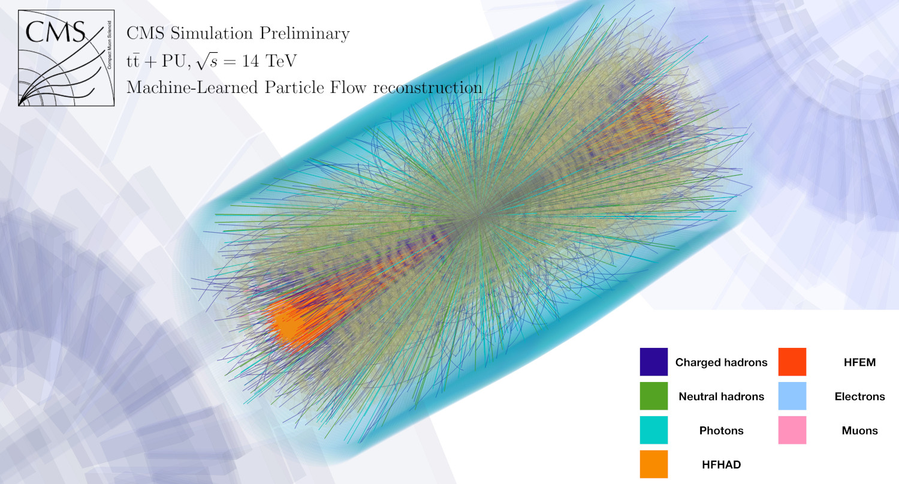
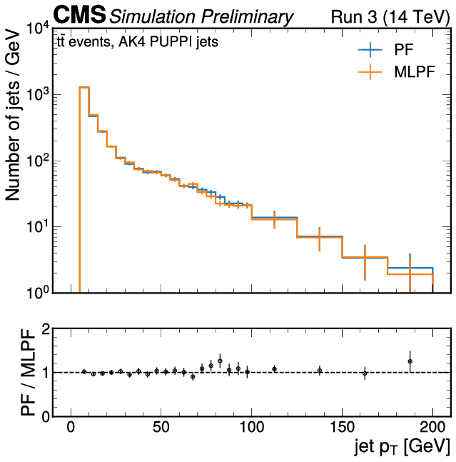
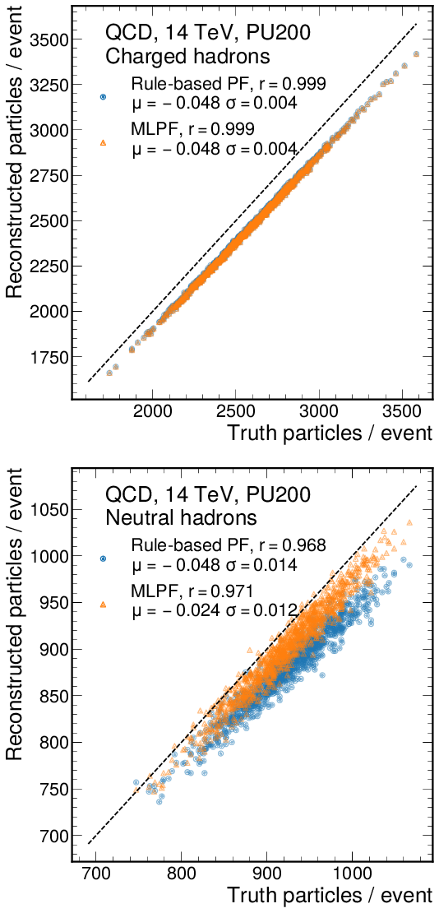
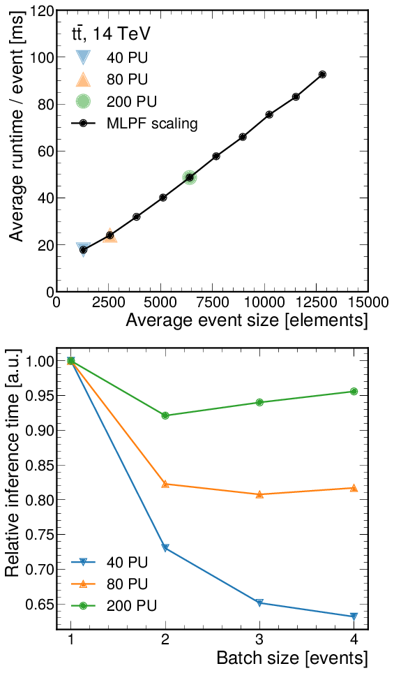

# Overview
MLPF focuses on developing full event reconstruction based on computationally scalable and flexible end-to-end ML models.

  

## MLPF development in CMS

  
  

  

  - 2022
    - ML4Jets 2022: https://indico.cern.ch/event/1159913/contributions/5101642/attachments/2541214/4374683/ml4jets_2022_mlpf_dsr.pdf
    - ACAT 2022: https://indico.cern.ch/event/1106990/contributions/4998026/attachments/2533513/4359689/mlpf_acat_v2.pdf
    - CERN-CMS-DP-2022-061: http://cds.cern.ch/record/2842375
  - 2021
    - ACAT 2022: J. Phys. Conf. Ser. 2438 012100, http://dx.doi.org/10.1088/1742-6596/2438/1/012100
    - CERN-CMS-DP-2021-030: https://cds.cern.ch/record/2792320

## Initial development with Delphes

  
  

  - paper: https://doi.org/10.1140/epjc/s10052-021-09158-w
  - code: https://doi.org/10.5281/zenodo.4559587
  - dataset: https://doi.org/10.5281/zenodo.4559324
