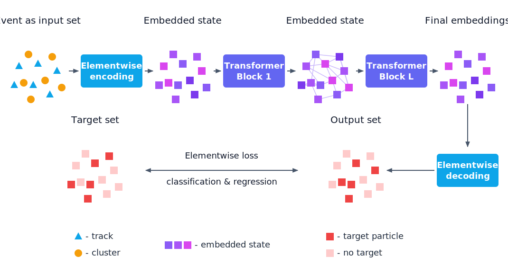

### **TLDR; I just want to run the code**
You can use `uv` to set up the repo and test that everything works:
```
git clone https://github.com/jpata/particleflow.git
uv sync
uv run ./scripts/local_test_cld.sh
uv run ./scripts/local_test_cms.sh
```

Alternatively, you can use a prepared container:
```
apptainer exec --nv https://jpata.web.cern.ch/jpata/pytorch-20260305-08d6950.sif ./scripts/local_test_cld.sh
apptainer exec --nv https://jpata.web.cern.ch/jpata/pytorch-20260305-08d6950.sif ./scripts/local_test_cms.sh
```

### **Summary**

**ML-based particle flow (MLPF)** focuses on developing full event reconstruction for particle detectors using computationally scalable and flexible machine learning models. The project aims to improve particle flow reconstruction across various detector environments, including CMS, as well as future detectors via Key4HEP.
We build on existing, open-source simulation software by the experimental collaborations.

<p float="left">
  
</p>

---


### **Datasets**

If you wish to train on pre-made datasets, you can download them from the [Hugging Face Hub](https://huggingface.co/datasets/jpata/particleflow).
To download a specific dataset and split (e.g., CLD, PF setup, configuration split 1):
```bash
uv run hf download jpata/particleflow \
  --include "tensorflow_datasets/cld/cld_edm_*_pf/1/*" \
  --local-dir data/tfds \
  --repo-type dataset
```
This will download the requested files into `data/tfds/tensorflow_datasets/cld/cld_edm_*_pf/1/`.

### **Training**

Run the training on the downloaded data configuration split
```
uv run \
    python mlpf/pipeline.py \
    --spec-file particleflow_spec.yaml \
    --production cld \
    --model-name pyg-cld-v1 \
    --data-dir data/tfds/tensorflow_datasets/cld \
    train \
    --data_config 1 \
    --gpu_batch_multiplier 4 \
    --gpus 1
```

## **End-to-end workflow: dataset generation and model training**

The full data generation, model training, and validation workflow are managed using [Pixi](https://pixi.sh/) for environment and [Snakemake](https://snakemake.readthedocs.io/) for job orchestration. Apptainer images are used to provide the software for the steps for different detetors.

```bash
# install pixi, restart your shell or source your .bashrc after this. only do once.
curl -fsSL https://pixi.sh/install.sh | bash

# copy the configuration for your site. only do once.
ln -s configs/{local,tallinn,lxplus}/pixi.toml pixi.toml

# initalize the orhcestrator python environment. only do this once.
pixi run init

# generate the snakefile (will overwrite the defaults)
PROD={cms_run3,clic,cld} pixi run snakefile

# run the steps (this will take many days and thousands of jobs), so run inside screen or tmux
PROD={cms_run3,clic,cld} pixi run gen
PROD={cms_run3,clic,cld} pixi run post
PROD={cms_run3,clic,cld} pixi run tfds
PROD={cms_run3,clic,cld} pixi run train
```

---

### **Publications**

Below is the development timeline of MLPF by our team, ranging from initial proofs of concept to full detector simulations and fine-tuning studies.

**2021: First full-event GNN demonstration of MLPF**
* **Paper:** [MLPF: efficient machine-learned particle-flow reconstruction using graph neural networks](https://doi.org/10.1140/epjc/s10052-021-09158-w) (Eur. Phys. J. C)
* **Focus:** Initial idea with a GNN and scalable graph building.
* **Code:** [v1.1](https://zenodo.org/records/4559587)
* **Dataset:** [Zenodo Record](https://doi.org/10.5281/zenodo.4559324)

**2021: First demonstration in CMS Run 3**
* **Paper:** [Machine Learning for Particle Flow Reconstruction at CMS](http://dx.doi.org/10.1088/1742-6596/2438/1/012100) (J. Phys. Conf. Ser.)
* **Focus:** First demonstration of feasibility within CMS.
* **Detector Performance Note:** [CERN-CMS-DP-2021-030](https://cds.cern.ch/record/2792320)

**2022: Improved performance in CMS Run 3**
* **Detector Performance Note:** [CERN-CMS-DP-2022-061](http://cds.cern.ch/record/2842375)
* **Focus:** We showed that training against a generator-level target can improve performance in CMS.

**2024: Improved performance with full simulation for future colliders**
* **Paper:** [Improved particle-flow event reconstruction with scalable neural networks for current and future particle detectors](https://doi.org/10.1038/s42005-024-01599-5) (Communications Physics)
* **Focus:** Improved event-level performance in full simulation for future colliders.
* **Code:** [v1.6.2](https://zenodo.org/records/10928968)
* **Results:** [Zenodo Record](https://doi.org/10.5281/zenodo.10567397)

**2025: Fine-tuning across detectors**
* **Paper:** [Fine-tuning machine-learned particle-flow reconstruction for new detector geometries in future colliders](https://doi.org/10.1103/PhysRevD.111.092015) (Phys. Rev. D)
* **Focus:** Showing that the amount of training data can be reduced by 10x by fine-tuning.
* **Code:** [v2.3.0](https://zenodo.org/records/14930299)

**2026: CMS Run 3 full results**
* **Detector Performance Note:** [CERN-CMS-DP-2025-033](https://cds.cern.ch/record/2937578)
* **Focus:** Improve jet performance over baseline, first validation on real data.
* **Paper:** [CMS Run 3 paper](https://arxiv.org/abs/2601.17554) (submitted to EPJC)
* **Code:** [v2.4.0](https://zenodo.org/records/15573658)

---

### **Citations and Reuse**

You are welcome to reuse the code in accordance with the [LICENSE](https://github.com/jpata/particleflow/blob/main/LICENSE).

**How to Cite**

1. **Academic Work:** Please cite the specific papers listed in the **Publications** section above relevant to the method you are using (e.g., initial GNN idea, fine-tuning, or specific detector studies).
2. **Code Usage:** If you use the code significantly for research, please cite the specific [tagged version from Zenodo](https://zenodo.org/search?q=parent.id%3A4452541&f=allversions%3Atrue&l=list&p=1&s=10&sort=version).
3. **Dataset Usage:** Cite the [appropriate dataset](https://zenodo.org/search?q=mlpf&f=allversions%3Atrue&f=resource_type%3Adataset&l=list&p=1&s=10&sort=version) via the Zenodo link and the corresponding paper.

**Contact**

For collaboration ideas that do not fit into the categories above, please [get in touch via GitHub Discussions](https://github.com/jpata/particleflow/discussions/categories/general).
