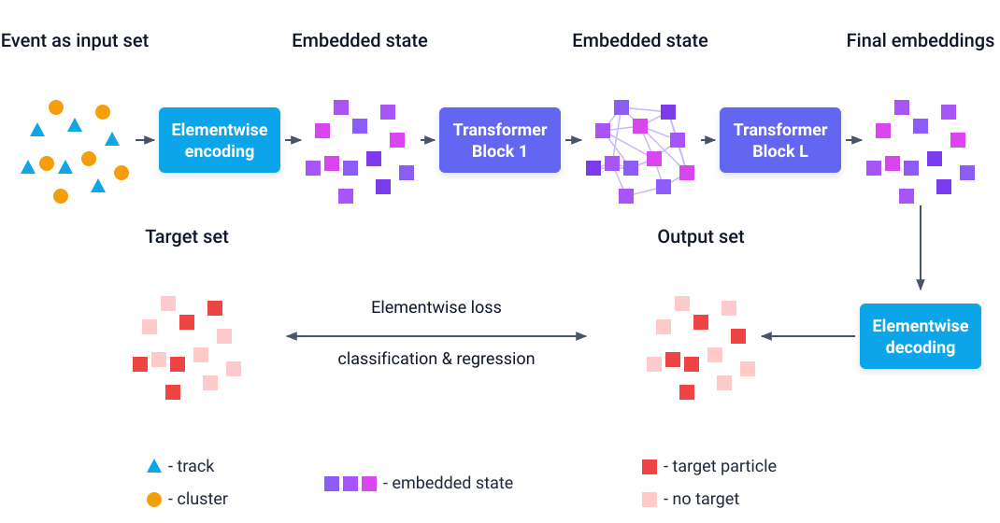

### **Summary**

**ML-based particle flow (MLPF)** focuses on developing full event reconstruction for particle detectors using computationally scalable and flexible machine learning models. The project aims to improve particle flow reconstruction across various detector environments, including CMS, as well as future detectors via Key4HEP.
We build on existing, open-source simulation software by the experimental collaborations.

<p float="left">
  
</p>

---

### **TLDR; I just want to run the code**
You can use `uv` to set up the repo and test that everything works:
```
git clone --recurse-submodules https://github.com/jpata/particleflow.git
uv sync --project envs/ort-gpu
uv run ./scripts/local_test_cld.sh
uv run ./scripts/local_test_cms.sh
```

Alternatively, you can use a prepared container:
```
apptainer exec --nv https://jpata.web.cern.ch/jpata/pytorch-20260305-08d6950.sif ./scripts/local_test_cld.sh
apptainer exec --nv https://jpata.web.cern.ch/jpata/pytorch-20260305-08d6950.sif ./scripts/local_test_cms.sh
```


### **Datasets**

If you wish to train on pre-made datasets, you can download them from the [Hugging Face Hub](https://huggingface.co/datasets/jpata/particleflow).
To download a specific dataset and split (e.g., CLD, PF setup, configuration split 1):
```bash
uv run hf download jpata/particleflow \
  --include "tensorflow_datasets/cld/cld_edm_*_pf/1/*" \
  --local-dir data/tfds \
  --repo-type dataset
```
This will download the requested files into `data/tfds/tensorflow_datasets/cld/cld_edm_*_pf/1/`.

### **Dataset Upload**

The upload script has separate commands for TFDS, ROOT, and Parquet data. Preview any
selection with `--dry-run`; completed files are skipped when their Hub path and size
match the local file.

```bash
# Upload TFDS split 1 for one version
uv run python3 scripts/upload_hf.py tfds clic 1 --version 3.2.1 --dry-run

# Upload the first two ROOT files from every configured CLIC sample
uv run python3 scripts/upload_hf.py root clic --num-files 2 --dry-run

# Upload only Parquet files corresponding to ROOT files already on the Hub
uv run python3 scripts/upload_hf.py parquet clic --dry-run
```

Remove `--dry-run` after checking the selection. Use repeatable `--sample NAME` or
`--dataset NAME` options to narrow an upload. For a campaign not present in
`particleflow_spec.yaml`, provide its workspace explicitly, for example:

```bash
uv run python3 scripts/upload_hf.py parquet idea \
  --workspace-dir /local/joosep/mlpf/idea/IDEA_o1_v03_fccconfig_a05a3a9 \
  --dry-run
```

### **Training**

Run the training on the downloaded data configuration split
```
uv run \
    python mlpf/pipeline.py \
    --spec-file particleflow_spec.yaml \
    --production cld \
    --model-name pyg-cld-v1 \
    --data-dir data/tfds/tensorflow_datasets/cld \
    train \
    --data_config 1 \
    --gpu_batch_multiplier 4 \
    --gpus 1
```

### **Model Upload**

To upload a trained model to the Hugging Face Hub:
```bash
uv run python3 scripts/upload_model_hf.py experiments/pyg-clic-hits-v1_clic_20260328_144021_479374 --version v3.1.0
```

### **Model Download & Evaluation**

To download a specific model (e.g., CLD, cluster-based, version v3.1.0) and run evaluation on a sample ROOT file:

1. Download the model files from the Hugging Face Hub:
```bash
uv run hf download jpata/particleflow \
  --include "cld/clusters/v3.1.0/pyg-cld-v1_cld_20260328_101206_533260/*" \
  --local-dir models \
  --repo-type model
```

2. Run the evaluation script:
```bash

mkdir -p local_test_data/cld/p8_ee_ttbar_ecm365/root
cd local_test_data/cld/p8_ee_ttbar_ecm365/root
wget -q --no-check-certificate -nc https://jpata.web.cern.ch/jpata/mlpf/cld/v1.2.3_key4hep_2025-05-29_CLD_f1e8f9/gen/root/reco_p8_ee_ttbar_ecm365_300000.root
cd ../../..

uv run python3 mlpf/standalone_eval/key4hep/evaluator.py \
  --input local_test_data/cld/p8_ee_ttbar_ecm365/root/reco_p8_ee_ttbar_ecm365_300000.root \
  --checkpoint models/cld/clusters/v3.1.0/pyg-cld-v1_cld_20260328_101206_533260/checkpoints/best_weights.pth \
  --detector cld \
  --outpath eval_results.parquet
```
The input ROOT file should be in the [EDM4hep format](https://github.com/key4hep/EDM4hep).

## **End-to-end workflow: dataset generation and model training**

The full data generation, model training, and validation workflow are managed using [Pixi](https://pixi.sh/) for environment and [Snakemake](https://snakemake.readthedocs.io/) for job orchestration. Apptainer images are used to provide the software for the steps for different detetors.

```bash
#ensure all gen configs are downloaded
git submodule update --init --recursive

# install pixi, restart your shell or source your .bashrc after this. only do once.
curl -fsSL https://pixi.sh/install.sh | bash

# copy the configuration for your site. only do once.
ln -s configs/{local,tallinn,lxplus}/pixi.toml pixi.toml

# initalize the orhcestrator python environment. only do this once.
pixi run init

# generate the snakefile (will overwrite the defaults)
PROD={cms_run3,clic,cld} pixi run snakefile

# run the steps (this will take many days and thousands of jobs), so run inside screen or tmux
PROD={cms_run3,clic,cld} pixi run gen
PROD={cms_run3,clic,cld} pixi run post
PROD={cms_run3,clic,cld} pixi run tfds
PROD={cms_run3,clic,cld} pixi run train
```

---

### **Publications**

The following publications trace the development of MLPF from early proofs of concept to full detector simulations and fine-tuning studies across detectors.

* [2021] First full-event GNN demonstration of MLPF: [Paper](https://doi.org/10.1140/epjc/s10052-021-09158-w) [Code](https://zenodo.org/records/4559587) [Dataset](https://doi.org/10.5281/zenodo.4559324)
* [2021] First demonstration in CMS Run 3: [Paper](http://dx.doi.org/10.1088/1742-6596/2438/1/012100) [CMS-DP](https://cds.cern.ch/record/2792320)
* [2022] Improved performance in CMS Run 3: [CMS-DP](http://cds.cern.ch/record/2842375)
* [2024] Improved performance with full simulation for future colliders: [Paper](https://doi.org/10.1038/s42005-024-01599-5) [Code](https://zenodo.org/records/10928968) [Results](https://doi.org/10.5281/zenodo.10567397)
* [2025] Fine-tuning across detectors: [Paper](https://doi.org/10.1103/PhysRevD.111.092015) [Code](https://zenodo.org/records/14930299)
* [2026] CMS Run 3 full results: [Paper](https://arxiv.org/abs/2601.17554) [CMS-DP](https://cds.cern.ch/record/2937578) [Code](https://zenodo.org/records/15573658)

---

### **Citations and Reuse**

You are welcome to reuse the code in accordance with the [LICENSE](https://github.com/jpata/particleflow/blob/main/LICENSE).

**How to Cite**

1. **Academic Work:** Please cite the specific papers listed in the **Publications** section above relevant to the method you are using (e.g., initial GNN idea, fine-tuning, or specific detector studies).
2. **Code Usage:** If you use the code significantly for research, please cite the specific [tagged version from Zenodo](https://zenodo.org/search?q=parent.id%3A4452541&f=allversions%3Atrue&l=list&p=1&s=10&sort=version).
3. **Dataset Usage:** Cite the [appropriate dataset](https://zenodo.org/search?q=mlpf&f=allversions%3Atrue&f=resource_type%3Adataset&l=list&p=1&s=10&sort=version) via the Zenodo link and the corresponding paper.

**Contact**

For collaboration ideas that do not fit into the categories above, please [get in touch via GitHub Discussions](https://github.com/jpata/particleflow/discussions/categories/general).
