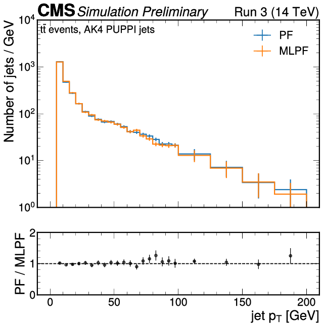

# MLPF overview

  

## MLPF with CMS

  
  

  

  - ACAT 2022: http://cds.cern.ch/record/2842375
  - ACAT 2021: http://cds.cern.ch/record/2802826

## MLPF with Delphes

  - paper: https://doi.org/10.1140/epjc/s10052-021-09158-w
    - code: https://doi.org/10.5281/zenodo.4559587
    - dataset: https://doi.org/10.5281/zenodo.4559324

Short instructions with a single test file in [notebooks/delphes-tf-mlpf-quickstart.ipynb](notebooks/delphes-tf-mlpf-quickstart.ipynb).

Long instructions for reproducing the full training from scratch in [README_delphes.md](README_delphes.md).
The plots can be generated using the notebook [delphes/delphes_model_analysis.ipynb](delphes/delphes_model_analysis.ipynb).
