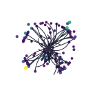

# CLD datasets

CLD datasets use Key4HEP/EDM4hep production at 365 GeV. The configured samples
are `ttbar`, fully hadronic `WW`, inclusive `qq`, and `ZZ`; the standard model
recipe uses the first three.

| Representation | Dataset names | Model recipe |
|---|---|---|
| Tracks and clusters | `cld_edm_{ttbar,ww_fullhad,qq,zz}_pf` | `pyg-cld-v1` |
| Detector hits | `cld_edm_{ttbar,ww_fullhad,qq,zz}_hits` | `pyg-cld-hits-v1` |

Both representations use dataset version 3.2.1 and configuration partitions
1--10.

## Event view

Tracks and calorimeter clusters are shown beside the target particles for a
representative `ttbar` event in the transverse plane.

| Tracks and clusters | Target particles |
|:---:|:---:|
|  |  |

Target labels use $e$, $\mu$, $\tau$, $\nu$, $\gamma$, $\pi$, and $K^0$.

## Production

Use the [shared Key4HEP workflow](key4hep.md) with `PROD=cld`. Build the
track/cluster representation with `pixi run tfds`, or follow [Hit-based
datasets](hit-based.md) for detector-hit inputs.
