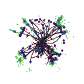
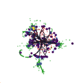

# Hit-based datasets

Hit-based inputs are a research workflow for CLD and CLIC. The track-and-cluster datasets in the [catalog](catalog.md) provide the default path; studies of raw tracker and calorimeter measurements use the hit workflow described here.

## What changes

| Property | Track/cluster (`*_pf`) | Hit (`*_hits`) |
|---|---|---|
| Input elements | Reconstructed tracks and calorimeter clusters | Tracker hits and calorimeter hits |
| TFDS task | `pixi run tfds` | `pixi run tfds_hit` |
| CLD model | `pyg-cld-v1` | `pyg-cld-hits-v1` |
| CLIC model | `pyg-clic-v1` | `pyg-clic-hits-v1` |
| Baseline candidates | Stored in `ycand` | `ycand` is a zero-filled placeholder |
| Operational status | Supported default | Research workflow |

Both representations are derived from the same validated Key4HEP Parquet files. The hit builder combines tracker and calorimeter hits into the input array `X`. The feature metadata identifies each element's type and geometry, and `ytarget` contains the corresponding particle target for each input row. Generator missing momentum and generator/target jets remain event-level fields.

## Detector-level event views

These transverse-plane views show the detector collections for a representative
event. Tracker hits are red, ECAL hits blue, HCAL hits green, and muon-system
hits orange. Dark curves are reconstructed tracks; energy-scaled purple-to-yellow
markers are calorimeter clusters. The display overlays both representations to
show their geometric relationship: a `*_hits` model receives the selected hit
collections, whereas a `*_pf` model receives reconstructed tracks and clusters.

| CLD, 365 GeV | CLICdet, 380 GeV |
|:---:|:---:|
|  |  |

The views subsample at most 600 hits per collection for readability and should
not be used to infer detector occupancy. See [CLD and CLIC data
production](key4hep.md) for the corresponding particle-target views and the
production path that supplies both representations.

The [catalog](catalog.md) lists the available hit datasets, versions, and model recipes.

## Production and validation

Follow [CLD and CLIC production](key4hep.md) through strict Parquet validation, then build the hit representation:

```bash
PROD=cld pixi run tfds_hit
```

Verify the exact TFDS name, configuration, and version. For example, after producing CLD `ttbar` configuration 1:

```bash
uv run python - <<'PY'
import tensorflow_datasets as tfds

builder = tfds.builder(
    "cld_edm_ttbar_hits/1:3.2.1",
    data_dir="/path/to/cld-workspace/tfds",
)
event = builder.as_data_source(split="train")[0]
print(builder.info.full_name, event["X"].shape, event["ytarget"].shape)
PY
```

Success requires the same number of input and target rows. The hit-geometry and hit-representation gates in the Parquet validation report establish the corresponding detector relationships.

## Resource expectations

Hit events contain many more elements than track/cluster events. This increases TFDS size, data-loading pressure, attention memory, padding waste, and training time. Hardware requirements therefore depend on the event-size distribution and model settings.

Before a large run:

1. inspect element-count distributions from representative Parquet files;
2. build and decode one TFDS configuration;
3. run a short training with the dedicated hit recipe;
4. measure peak host and accelerator memory;
5. scale workers, open-reader limits, padding, and batch accumulation from that measurement.

Start with the smaller `gpu_batch_multiplier` values in the checked-in hit recipe for the matching detector, then tune them from measured memory use.
